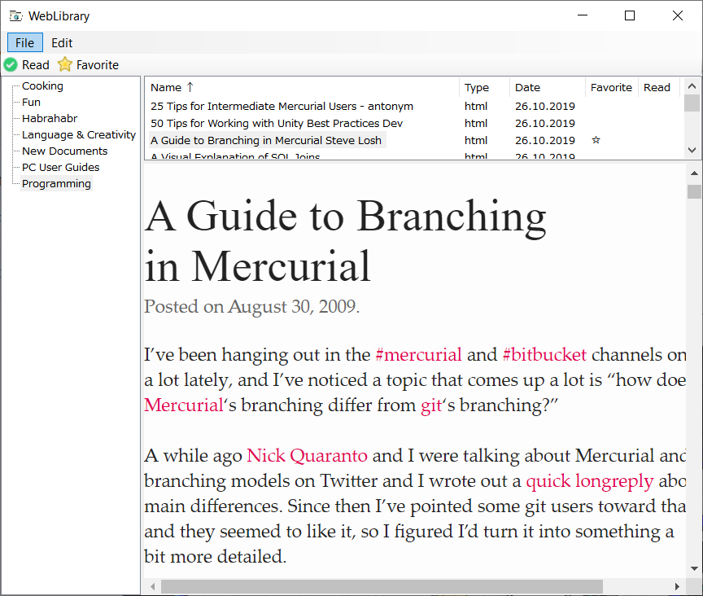

# WebLibrary
The purpose of WebLibrary is to be a convenient offline browser/organizer of locally stored internet documents. The most typical use case is to read web pages, saved "for later reading". Naturally, this can be done merely with a web browser, but my experience shows that even a simple organizing system can be handy.

## Functionality
WebLibrary is still a the early stage of development, so the capabilities aren't rich yet, but sufficient for basic daily use.

These are the things you can do:

* Display any folder of your computer as a "Library".
* View individual saved documents in a browser window.
* Mark documents as "Favorite" or "Read".
* Sort documents by name, type, or favorite/read status.

WebLibrary supports keyboard shortcuts, so many basic operations can be perfomed quickly and without annoying mouse clicks. The content of the library is updated automatically, so when files appear or get deleted in the library folder, the main applicaton screen is updated accordingly.

## Content saving and synchronization
To facilitate content saving, WebLibrary provides two additional tools: a Chrome-compatible browser extension for saving web pages, and a GUI app for choosing the current save location. To access your documents from different devices, simply place your library into a cloud-synchronized folder.

## Alternatives
There are other, much more function-rich systems like [TagSpaces](https://www.tagspaces.org/) or [myBase](http://www.wjjsoft.com/mybase.html). I tried using them several times on daily basis, but always had to face with problems like poor page rendering, lack of hotkeys or synchronization issues. However, your experience might be very different.

## Setup
WebLibrary is being developed in very scarce periods of free time and thus heavily relies on third-party components. Unfortunately, it means that its setup is a relatively complicated process at the moment. Note also that only a 64-bit Windows build is currently available.

### Prerequisites
1. [Node.js](https://nodejs.org/en/) runtime.
1. Any Chrome-compatible web browser.
1. [External Application Button](https://chrome.google.com/webstore/detail/external-application-butt/bifmfjgpgndemajpeeoiopbeilbaifdo) Chrome extension. Make sure to click the extension button once and install the "native client" component as instructed.

### Installing WebLibrary and WebLibraryDownloader
1. Depack `WebLibrary-x64.zip` into any folder of your choice.
1. Add this folder into your `PATH` environment variable.
1. Run `SetupWebLibrary.bat` script to install additional dependencies.
1. Run `WebLibraryApp.exe` and choose the location of your library folder. As noted above, it is a good idea to keep it in a cloud-synchronized place.
1. Run `WebLibraryDownloader.exe` and choose the library folder once again. Also provide a path to your Chrome-compatible browser.

### Installing the Chrome Extension
1. Open `chrome://extensions` location in your browser.
1. Enable "Developer mode" in the top-right corner.
1. Press "Load unpacked" button and choose `WebLibraryExt` folder inside your installation path. Extension button should appear in the browser toolbar.

## Tech details
WebLibrary is written in C# and uses [CefSharp](https://github.com/cefsharp/CefSharp/) library to display HTML documents. Metainformation, such as "Favorite" and "Read" flags is encoded in file names (a file `doc.html` becomes `doc{R,S}.html` when it is marked as both read and favorite/starred). 

The project can be built with MS Visual Studio 2017. Open `Developer Command Prompt for VS 2017`, navigate to the project folder and run `BuildAndPack.bat`. Make sure to have NuGet installed, since it is used to restore missing `CefSharp` packages.

Web pages are saved with the help of a third-party tool [SingleFile](https://github.com/gildas-lormeau/SingleFile). WebLibrary Chrome extension uses [External Application Button](https://add0n.com/external-application-button.html) to call `WebLibraryDownloader.exe` and pass it the URL of the current page to be saved.

